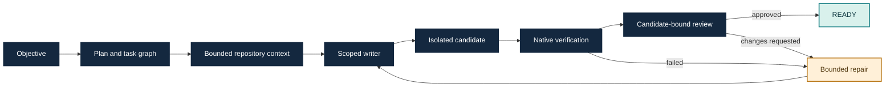

# Fabric

Fabric is a repository-bound engineering agent runner. It turns a coding
objective into a plan, scoped candidate changes, native checks and an
independent review, with durable evidence for each step. Go owns orchestration;
Rust provides optional repository intelligence.

Start with the [documentation hub](docs/README.md). It separates current user
guides and contracts from development notes, historical checkpoints and
release-specific evidence.

## Why Fabric?

A coding agent needs more than a prompt and permission to edit files. Fabric
coordinates the work around a concrete repository: which tasks are ready,
which files a writer owns, what context each role receives, and which checks
must pass before a candidate is ready for integration.

You supply the objective, model runtime and project checks. Fabric retains the
plan, candidate changes, verification results, review and usage accounting so
you can inspect how the result was produced. Its main interface is a CLI;
the result is an isolated Git worktree and durable run evidence.

| Capability | What it gives you |
| --- | --- |
| Dependency-aware planning | Research, implementation, verification and review tasks with explicit readiness |
| Scoped implementation | Declared file ownership and checked edits against the exact candidate |
| Native verification | Your project's commands run on the changed candidate |
| Independent review | A separate role evaluates the candidate before READY |
| Bounded repair | Failed checks or requested changes lead to repairs within the admitted scope and budget |
| Repair diagnosis | `fabric diagnose RUN` separates recorded failures from review concerns and exposes existing admitted repair scope |
| Context selection | Bounded repository evidence selected for the task and role; optional Rust intelligence |
| Runtime choice | Configured Codex, OpenCode or direct-provider adapters, with explicit model choices |
| Durable inspection | Run identity, diff, checks, review, checkpoints and token categories remain inspectable |

Independent research tasks can overlap. Disjoint initial writers are opt-in;
real end-to-end parallel-writer acceptance remains pending. See the
[capability guide](docs/guides/features.md) for configuration and evidence limits.

## Use cases

| Situation | Example objective | Acceptance you configure |
| --- | --- | --- |
| Fix a repository bug | “Fix multiline environment-value parsing and add regression tests.” | Project tests plus parser-specific checks |
| Implement a bounded feature | “Add numeric text parsing while preserving existing behavior.” | Tests for the new API and existing contracts |
| Refactor safely | “Simplify this component without changing public behavior.” | Existing tests, build and any compatibility checks |
| Improve a hot path | “Reduce allocations in this function while preserving results.” | Correctness tests and a relevant performance check |
| Investigate a larger change | “Identify the affected components, then implement the scoped fix.” | A reviewed candidate and checks for the affected components |

These are task patterns, not promises that arbitrary projects or objectives
will succeed. The retained evaluation includes real tasks in go-humanize,
afero, go-multierror, go-atomic, go-difflib, godotenv and logr. Performance
changes require a project-specific measurement; a passing build alone does
not establish a speedup.

## Try Fabric

For published packages and their exact identities, use the [release guide](docs/guides/release.md).
The [installed-task walkthrough](docs/getting-started/installed-autonomous-task.md) retains the recorded v1.0.0 example.
For the current development checkout, use the [source-build autonomous guide](docs/guides/autonomous-task.md).
To build locally:

```sh
go build -o bin/ ./cmd/fabric
```

Run `fabric --help`, configure a committed project and its required native
checks, then start a bounded run with `fabric run --autonomous`. Review the
candidate with `fabric inspect RUN`, `fabric diff RUN`, `fabric usage RUN` and
`fabric checkpoint RUN`. Changes remain in an isolated worktree for explicit
operator integration; Fabric does not publish them automatically.

### One documented happy path

On Windows, install Git, Go 1.27.1 and an authenticated Codex executable.
Build Fabric, then initialize it inside the committed repository you want to
change:

```powershell
git clone https://github.com/iancuuandrei/Fabric.git Fabric
Set-Location Fabric
go build -o fabric.exe ./cmd/fabric
$fabric = (Resolve-Path ./fabric.exe).Path
$codex = 'C:\path\to\codex.exe' # Your installed executable.
& $codex login
Set-Location 'C:\path\to\your\committed-project'
Add-Content .git/info/exclude "`n.harness/`nharness.toml`n"
& $fabric init --codex $codex --model gpt-6-luna --effort high
# Edit harness.toml: configure this project's required verification commands.
& $fabric doctor
& $fabric run --autonomous 'Fix the parser bug and add regression tests.'
& $fabric inspect
& $fabric diff
& $fabric usage
```

The model must be available in your authenticated runtime. `init` defaults to
`go test ./...`; replace that check when your project requires different
commands. `doctor` checks readiness, not task correctness. `inspect` supplies
the run ID and candidate workspace; use that ID to inspect a specific run or
continue it with `fabric resume --autonomous RUN` when its state permits.
An uncertain provider effect does not authorize a resend.

Follow the [complete autonomous-task guide](docs/guides/autonomous-task.md)
for project policy, runtime configuration, repair limits and continuation.

## How a task reaches READY



`READY` means the candidate passed its configured verification and review
gates. It does not mean the change was committed, merged or released.

## Boundaries and current limitations

- Windows amd64 has a published package; Linux installed qualification remains pending.
- Optional repository intelligence contributes bounded evidence, not complete understanding of a codebase.
- Local caches do not replace fresh candidate verification and review.
- Provider capacity and transport failures can block a task. Retained diagnostics identify the stage and permitted next action; uncertain effects remain uncertain.
- Integration remains an operator decision. Fabric does not guarantee unrestricted autonomous completion or error-free execution.

## Documentation and releases

Use the [documentation hub](docs/README.md) for current guides and contracts,
[release guide](docs/guides/release.md) for immutable published packages, and
[evaluation index](docs/evaluation/status.md) for source-bound measurements
and acceptance records. Development and publication follow the
[source-history policy](docs/contributing/source-history.md).

## Project references

- [Documentation hub](docs/README.md)
- [System architecture](docs/architecture/system.md)
- [Capabilities and evidence boundaries](docs/guides/features.md)
- [CLI reference](docs/reference/cli.md)
- [Product roadmap](docs/roadmap/v2-product-plan.md)
- [Current implementation evidence](docs/evaluation/status.md)
- [Contributing](CONTRIBUTING.md)
