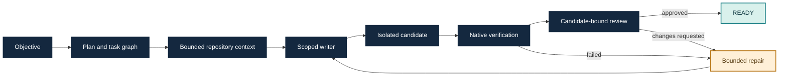

# Fabric

Fabric is a repository-bound engineering agent runner. It turns a coding
objective into a plan, scoped candidate changes, native checks and an
independent review, with durable evidence for each step. Go owns orchestration;
Rust provides optional repository intelligence.

> **Current product increment:** v1.1.3, implementation checkpoint
> `09a646522d3bfa0eb8cfbe545406971c695b7ffd` on `dev`.
> **Latest published package:** v1.1.0 for Windows amd64. The development source
> and its evaluation records are not a new installed release.

Start with the [documentation hub](docs/README.md). It separates current user
guides and contracts from development notes, historical checkpoints and
release-specific evidence.

## Why Fabric?

A coding agent needs more than a prompt and permission to edit files. Fabric
coordinates the work around a concrete repository: which tasks are ready,
which files a writer owns, what context each role receives, and which checks
must pass before a candidate is ready for integration.

You supply the objective, model runtime and project checks. Fabric retains the
plan, candidate changes, verification results, review and usage accounting so
you can inspect how the result was produced. Its main interface is a CLI;
the result is an isolated Git worktree and durable run evidence.

| Capability | What it gives you |
| --- | --- |
| Dependency-aware planning | Research, implementation, verification and review tasks with explicit readiness |
| Scoped implementation | Declared file ownership and checked edits against the exact candidate |
| Native verification | Your project's commands run on the changed candidate |
| Independent review | A separate role evaluates the candidate before READY |
| Bounded repair | Failed checks or requested changes lead to repairs within the admitted scope and budget |
| Context selection | Bounded repository evidence selected for the task and role; optional Rust intelligence |
| Runtime choice | Configured Codex, OpenCode or direct-provider adapters, with explicit model choices |
| Durable inspection | Run identity, diff, checks, review, checkpoints and token categories remain inspectable |

Independent research tasks can overlap. Disjoint initial writers are opt-in;
real end-to-end parallel-writer acceptance remains pending. See the
[capability guide](docs/guides/features.md) for configuration and evidence limits.

## Use cases

| Situation | Example objective | Acceptance you configure |
| --- | --- | --- |
| Fix a repository bug | “Fix multiline environment-value parsing and add regression tests.” | Project tests plus parser-specific checks |
| Implement a bounded feature | “Add numeric text parsing while preserving existing behavior.” | Tests for the new API and existing contracts |
| Refactor safely | “Simplify this component without changing public behavior.” | Existing tests, build and any compatibility checks |
| Improve a hot path | “Reduce allocations in this function while preserving results.” | Correctness tests and a relevant performance check |
| Investigate a larger change | “Identify the affected components, then implement the scoped fix.” | A reviewed candidate and checks for the affected components |

These are task patterns, not promises that arbitrary projects or objectives
will succeed. The retained evaluation includes real tasks in go-humanize,
afero, go-multierror, go-atomic, go-difflib, godotenv and logr. Performance
changes require a project-specific measurement; a passing build alone does
not establish a speedup.

## Try Fabric

For published packages and their exact identities, use the [release guide](docs/guides/release.md).
The [installed-task walkthrough](docs/getting-started/installed-autonomous-task.md) retains the recorded v1.0.0 example.
For the current development checkout, use the [source-build autonomous guide](docs/guides/autonomous-task.md).
To build locally:

```sh
go build -o bin/ ./cmd/fabric
```

Run `fabric --help`, configure a committed project and its required native
checks, then start a bounded run with `fabric run --autonomous`. Review the
candidate with `fabric inspect RUN`, `fabric diff RUN`, `fabric usage RUN` and
`fabric checkpoint RUN`. Changes remain in an isolated worktree for explicit
operator integration; Fabric does not publish them automatically.

### One documented happy path

On Windows, install Git, Go 1.27.1 and an authenticated Codex executable.
Build Fabric, then initialize it inside the committed repository you want to
change:

```powershell
git clone https://github.com/iancuuandrei/Fabric.git Fabric
Set-Location Fabric
go build -o fabric.exe ./cmd/fabric
$fabric = (Resolve-Path ./fabric.exe).Path
$codex = 'C:\path\to\codex.exe' # Your installed executable.
& $codex login
Set-Location 'C:\path\to\your\committed-project'
Add-Content .git/info/exclude "`n.harness/`nharness.toml`n"
& $fabric init --codex $codex --model gpt-6-luna --effort high
# Edit harness.toml: configure this project's required verification commands.
& $fabric doctor
& $fabric run --autonomous 'Fix the parser bug and add regression tests.'
& $fabric inspect
& $fabric diff
& $fabric usage
```

The model must be available in your authenticated runtime. `init` defaults to
`go test ./...`; replace that check when your project requires different
commands. `doctor` checks readiness, not task correctness. `inspect` supplies
the run ID and candidate workspace; use that ID to inspect a specific run or
continue it with `fabric resume --autonomous RUN` when its state permits.
An uncertain provider effect does not authorize a resend.

Follow the [complete autonomous-task guide](docs/guides/autonomous-task.md)
for project policy, runtime configuration, repair limits and continuation.

## How a task reaches READY



`READY` means the candidate passed its configured verification and review
gates. It does not mean the change was committed, merged or released.

## Results and benchmarks

The following are retained measurements with identified sources, not a new
benchmark of the rolling `main` tree. Model latency, repository size, checks
and provider availability all affect an end-to-end task.

### Real coding-task acceptance

On source `8c5a750`, using `gpt-6.1-sol` with high reasoning, the original
eight-task cohort passed **7/8**. Its remaining planner was refused because of
provider capacity. A separately authorized fresh `logr` successor passed
**1/1**, giving **8/8 accepted task identities** across the two records.
Every accepted candidate passed native verification, independent review and
its unchanged heldout checks. Seven accepted tasks required no repair; afero
required one.

This is not a single unchanged 8/8 attempt, an all-Muse result, or installed
release qualification. See the [closure report](docs/evaluation/v112-eight-task-closure.md)
and [machine-readable ledger](docs/evaluation/v112-eight-task-closure.json).

### Local context-cache measurements

| Workload / measured stage | Uncached | Cold cache | Warm cache | Source / samples |
| --- | ---: | ---: | ---: | --- |
| Synthetic 24 × 64 KiB Go corpus collection | 0.650 s | 0.652 s | 0.512 s | v1.0.9 / five |
| Pinned go-humanize corpus collection | 0.799 s | 0.812 s | 0.742 s | v1.0.9 / five |
| Complete go-humanize contract admission | 1.387 s | 1.763 s | 1.647 s | v1.0.25 / three |

Values are single-host medians on Windows/amd64. The collection timer excluded
graph and context construction; the admission timer covered the complete
admission stage. Cached and uncached outputs retained matching identities.
The complete admission sample **did not show a latency benefit**; collection
timings alone do not prove faster autonomous tasks. Go allocations were not
materially reduced in the collection sample. Exact source, toolchain, input
pins, receipt hashes and methodology are in the
[cache measurement report](docs/evaluation/autonomous-parse-cache.md).

### Observed model-token accounting

| Token category | Accepted eight-task coverage |
| --- | ---: |
| Input total | 8,705,419 |
| Cached input, included in input | 7,677,440 |
| Uncached input | 1,027,979 |
| Output total | 77,567 |
| Reasoning output, included in output | 32,526 |

These totals cover accepted runs only; usage for the refused predecessor was
unavailable. Provider prompt caching and Fabric's local syntax-fact cache are
different mechanisms. The figures establish observed usage, not comparative
token savings or a dollar cost. Use `fabric usage RUN` to inspect your own run.

## Boundaries and current limitations

- Windows amd64 has a published package; Linux installed qualification remains pending.
- Optional repository intelligence contributes bounded evidence, not complete understanding of a codebase.
- Local caches do not replace fresh candidate verification and review.
- Provider capacity and transport failures can block a task. Retained diagnostics identify the stage and permitted next action; uncertain effects remain uncertain.
- Integration remains an operator decision. Fabric does not guarantee unrestricted autonomous completion or error-free execution.

## Development source and public history

Development commits retain their full incremental history on `dev`. `main`
stores one rolling checkpoint for each major/minor line (`v1.0`, `v1.1`).
Trusted pushes update the matching rolling snapshot on `main` through the
`automation:fabric-v1-sol-supervisor` workflow, which verifies the current
`dev` tip and uses an exact `main` force-with-lease. For an existing
major/minor line, it replaces only that line's latest snapshot tree while
preserving its title, parent and original author/committer dates. A newer line
adds one snapshot parented by the previous `main`; an older line cannot replace
a newer one. The historical `v0.0.0` and `v0.0.1` checkpoints remain, and
published tags such as `v1.0.0` and `v1.1.0` are never moved. Routine pushes do
not create a PR; an explicitly created PR still uses the automation identity.

Because a rolling `main` snapshot can change its tree without changing its
creation date, development evidence must name the exact `dev` source SHA. See
the [source history and snapshot policy](docs/contributing/source-history.md)
for the complete rules.

The latest accepted task ledger records **8/8 task identities** across the
original 7/8 cohort and one separate fresh `logr` successor, on source
`8c5a750ddf32e569257ec2bb9371a24847565441`. It is not one unchanged 8/8 run and
is not a full reevaluation of v1.1.3. The [closure record](docs/evaluation/v112-eight-task-closure.md)
preserves that distinction and the later focused diagnostic checks.

## Published release

The latest immutable [v1.1.0 Windows release](https://github.com/iancuuandrei/Fabric/releases/tag/v1.1.0)
includes its own [published acceptance record](https://github.com/iancuuandrei/Fabric/releases/download/v1.1.0/v11-release-acceptance.json).
It is separate from the newer v1.1.3 source fixes and eight-task coverage ledger.

The immutable [v1.0.0 Windows release](https://github.com/iancuuandrei/Fabric/releases/tag/v1.0.0)
has its own [distribution and installed-task acceptance record](docs/evaluation/v1-release-acceptance.md).
Linux remains optional and unqualified. Package builds, development tests and
task-coverage ledgers each answer different questions; none substitutes for
the others.

## Project references

- [Documentation hub](docs/README.md)
- [System architecture](docs/architecture/system.md)
- [Capabilities and evidence boundaries](docs/guides/features.md)
- [CLI reference](docs/reference/cli.md)
- [Product roadmap](docs/roadmap/v2-product-plan.md)
- [Current implementation evidence](docs/evaluation/status.md)
- [Contributing](CONTRIBUTING.md)
