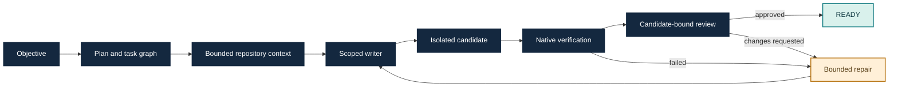

# Fabric

Fabric is a repository-bound engineering agent runner. It turns a coding
objective into a plan, scoped candidate changes, native checks and an
independent review, with durable evidence for each step. Go owns orchestration;
Rust provides optional repository intelligence.

> **Current product increment:** v1.1.3, implementation checkpoint
> `09a646522d3bfa0eb8cfbe545406971c695b7ffd` on `dev`.
> **Latest published package:** v1.1.0 for Windows amd64. The development source
> and its evaluation records are not a new installed release.

Start with the [documentation hub](docs/README.md). It separates current user
guides and contracts from development notes, historical checkpoints and
release-specific evidence.

## Try Fabric

For published packages and their exact identities, use the [release guide](docs/guides/release.md).
The [installed-task walkthrough](docs/getting-started/installed-autonomous-task.md) retains the recorded v1.0.0 example.
For the current development checkout, use the [source-build autonomous guide](docs/guides/autonomous-task.md).
To build locally:

```sh
go build -o bin/ ./cmd/fabric
```

Run `fabric --help`, configure a committed project and its required native
checks, then start a bounded run with `fabric run --autonomous`. Review the
candidate with `fabric inspect RUN`, `fabric diff RUN`, `fabric usage RUN` and
`fabric checkpoint RUN`. Changes remain in an isolated worktree for explicit
operator integration; Fabric does not publish them automatically.

## How a task reaches READY



`READY` means the candidate passed its configured verification and review
gates. It does not mean the change was committed, merged or released.

## Development source and public history

Development commits retain their full incremental history on `dev`. `main`
stores one rolling checkpoint for each major/minor line (`v1.0`, `v1.1`).
Trusted pushes update the matching rolling snapshot on `main` through the
`automation:fabric-v1-sol-supervisor` workflow, which verifies the current
`dev` tip and uses an exact `main` force-with-lease. For an existing
major/minor line, it replaces only that line's latest snapshot tree while
preserving its title, parent and original author/committer dates. A newer line
adds one snapshot parented by the previous `main`; an older line cannot replace
a newer one. The historical `v0.0.0` and `v0.0.1` checkpoints remain, and
published tags such as `v1.0.0` and `v1.1.0` are never moved. Routine pushes do
not create a PR; an explicitly created PR still uses the automation identity.

Because a rolling `main` snapshot can change its tree without changing its
creation date, development evidence must name the exact `dev` source SHA. See
the [source history and snapshot policy](docs/contributing/source-history.md)
for the complete rules.

The latest accepted task ledger records **8/8 task identities** across the
original 7/8 cohort and one separate fresh `logr` successor, on source
`8c5a750ddf32e569257ec2bb9371a24847565441`. It is not one unchanged 8/8 run and
is not a full reevaluation of v1.1.3. The [closure record](docs/evaluation/v112-eight-task-closure.md)
preserves that distinction and the later focused diagnostic checks.

## Published release

The latest immutable [v1.1.0 Windows release](https://github.com/iancuuandrei/Fabric/releases/tag/v1.1.0)
includes its own [published acceptance record](https://github.com/iancuuandrei/Fabric/releases/download/v1.1.0/v11-release-acceptance.json).
It is separate from the newer v1.1.3 source fixes and eight-task coverage ledger.

The immutable [v1.0.0 Windows release](https://github.com/iancuuandrei/Fabric/releases/tag/v1.0.0)
has its own [distribution and installed-task acceptance record](docs/evaluation/v1-release-acceptance.md).
Linux remains optional and unqualified. Package builds, development tests and
task-coverage ledgers each answer different questions; none substitutes for
the others.

## Project references

- [Documentation hub](docs/README.md)
- [System architecture](docs/architecture/system.md)
- [Capabilities and evidence boundaries](docs/guides/features.md)
- [CLI reference](docs/reference/cli.md)
- [Product roadmap](docs/roadmap/v2-product-plan.md)
- [Current implementation evidence](docs/evaluation/status.md)
- [Contributing](CONTRIBUTING.md)
