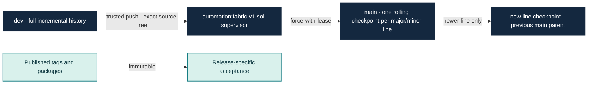
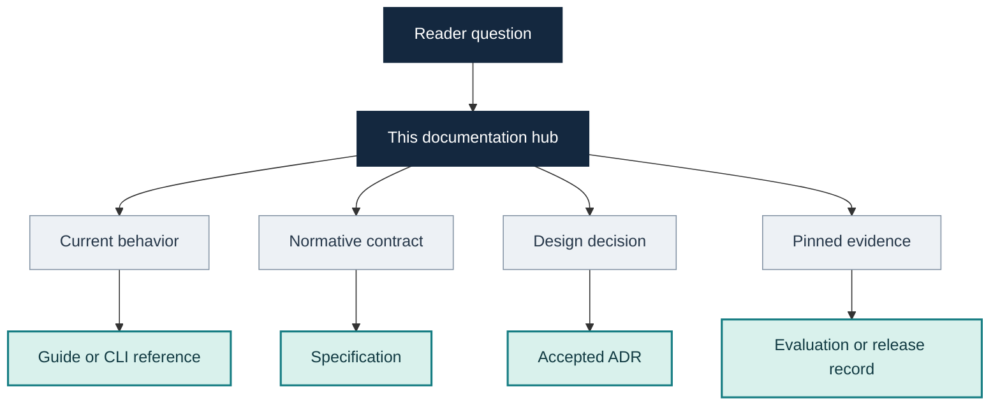

# Fabric documentation

This hub is the map for using, understanding and evaluating Fabric. Start with
the row that matches your question; follow the linked source for the details.

## Choose a path

| If you need to… | Start here | What it covers |
|---|---|---|
| Choose a published package | [Release guide](guides/release.md#published-packages) | Current v1.1.0 package, exact hashes and version-specific acceptance |
| Follow the recorded installation example | [Windows installed-task guide](getting-started/installed-autonomous-task.md) | Preserved v1.0.0 download, setup, bounded task and result inspection |
| Build the current source and run a task | [Autonomous task guide](guides/autonomous-task.md) | Prerequisites, model configuration, checks, run, inspect and resume |
| Exercise local planning without a provider | [Local plan guide](getting-started/local-plan.md) | Approval, replay and failure behavior for the fake planning route |
| Read the earlier source-built first-task record | [Real-task guide](getting-started/real-task.md) | The workflow accepted at its recorded source identity |
| Understand the product shape | [System architecture](architecture/system.md) | Control flow, authority boundaries, candidate gates and evidence |
| See what is implemented | [Capabilities](guides/features.md) | Capability map, entry points, limits and qualification links |
| Use a command or flag | [CLI reference](reference/cli.md) | Generated command and option reference |
| Understand a contract or design choice | [Specifications](specifications/) and [ADRs](adr/) | Normative invariants and accepted architectural decisions |
| Contribute code or docs | [Contributing](../CONTRIBUTING.md) and [documentation standard](contributing/documentation-standard.md) | Local workflow, evidence rules, links, references and documentation structure |
| Check the public source history | [Source history policy](contributing/source-history.md) | Full `dev` history, rolling `main` snapshots, tags and trusted synchronization |

## Read claims at the right level

Fabric distinguishes product behavior from evidence about a particular source,
candidate, run or package. A check result applies to the exact item and scope
that was executed.

| Evidence | What it establishes | What it does not establish by itself |
|---|---|---|
| Source tests | The tested code paths passed in that checkout | Provider quality, an accepted candidate or release readiness |
| Candidate verification and review | That exact candidate passed its configured gates | A commit, merge, package or later-source result |
| Task-coverage ledger | The listed task identities have accepted evidence, with each cohort clearly named | One unchanged cohort if attempts came from separate runs |
| Package reproduction and installed task | The named artifact and installed workflow passed the recorded checks | Other platforms, source commits or later artifacts |
| Historical checkpoint | What was observed at the checkpoint's pinned source and time | Current implementation status when newer evidence exists |

Use **PASS**, **FAIL**, **NOT RUN**, **BLOCKED** and **UNKNOWN** as distinct
states. Missing usage, timing or provider evidence is unavailable; it is not
zero. Historical reports remain unchanged. Current summaries link newer
evidence rather than rewriting old observations.

## Source and snapshot map

The exact `dev` SHA is the source identity for current development claims. A
same-line snapshot may receive a new tree while retaining its original title,
parent and author/committer dates. The `v0.0.0` and `v0.0.1` checkpoints remain
historical; published tags are not rewritten. See the
[source history policy](contributing/source-history.md) for the operational
rules and exceptions.

## Documentation authority

| Document kind | Use it for | Authority boundary |
|---|---|---|
| Guide or CLI reference | How to use the current implementation | Must agree with source and parser behavior |
| Specification | Required behavior and invariants | A contract is not proof that implementation or qualification exists |
| ADR | Why a consequential design was selected | Historical rationale does not override a later accepted decision |
| Evaluation or release record | Exact source, candidate, artifact and observed checks | Evidence stays scoped to its recorded identities and methods |
| Roadmap or status ledger | Current direction, open work and links to evidence | Summaries do not replace the underlying acceptance record |

## Browse by topic

### Architecture and contracts

- [System architecture](architecture/system.md)
- [Run journal](specifications/run-journal.md)
- [Authority and effects](adr/0002-authority.md) · [journal effects](adr/0003-journal-effects.md) · [repository intelligence boundary](adr/0004-ri-boundary.md)
- [Security trust boundary](security/trust-boundary.md)

### Engineering capabilities

- [Autonomous task graphs](guides/graph-autonomous-task.md)
- [Repository intelligence and semantic queries](guides/engineering-orientation.md)
- [Go file facts](guides/go-file-facts.md)
- [Context and planner contracts](guides/planner-contract.md)
- [Parallel and isolated writers](guides/isolated-writers.md)
- [Impact-aware review](guides/reviewer-impact-context.md)
- [Model allocation](guides/model-allocation.md)
- [Usage accounting](guides/provider-token-accounting.md) · [Codex observations](guides/codex-native-usage-observations.md)
- [Checkpoints and continuation](guides/checkpoints.md) · [verified fresh rounds](guides/verified-fresh-rounds.md)
- [Runtime capability limits](guides/graceful-capabilities.md) · [Codex confinement](guides/codex-capability-confinement.md)
- [Task schedules](guides/task-schedules.md) · [prompt-cache recipes](guides/prompt-cache-recipes.md) · [deterministic Go formatting](guides/deterministic-go-format-observation.md)
- [Native compaction](guides/native-auto-compaction.md) · [file changes](guides/file-changes.md) · [local packaging](guides/local-packaging.md)
- [Optional procedures](guides/procedures.md) · [Codex CLI integration](../integrations/codex/engorch/README.md)

### Development and qualification

- [v1 product gate](development/v1-product-gate.md)
- [v2 product roadmap](roadmap/v2-product-plan.md)
- [Historical evaluation ledger](evaluation/status.md)
- [Eight-task coverage closure](evaluation/v112-eight-task-closure.md)
- [Real-repository comparison](evaluation/v1-real-repository-comparison.md)
- [v1.0.0 release acceptance](evaluation/v1-release-acceptance.md)
- [Real-repository evaluation harness](../evals/v1/README.md)
- [Research provenance](research/oss-mechanisms.md)

### Historical records

- [v0.0.0 bootstrap checkpoint](evaluation/v0.0.0.md)
- [v0.0.1 trusted bootstrap checkpoint](evaluation/v0.0.1.md)
- [WP05/WP06 program history](evaluation/wp05-wp06-history.md)
- [v1.0.0 Windows distribution acceptance](evaluation/v1-release-acceptance.md)

## Maintenance

When behavior changes, update its guide or contract in the same source
increment. Keep a single authoritative explanation for each rule and link to
it from navigation pages. Preserve historical evaluation records; append a
clearly dated current note or link when later evidence changes the status.
Follow the [documentation standard](contributing/documentation-standard.md).
