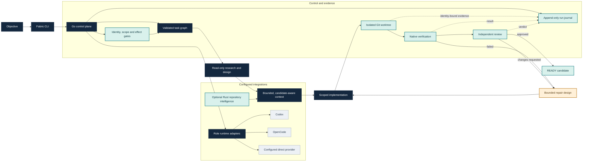

# System architecture

Fabric's Go control plane executes a coding objective through planning,
read-only exploration, scoped implementation, native verification, independent
review and bounded repair. Each run binds durable evidence to its repository,
candidate and configured policies. Rust supplies optional repository
intelligence through configured snapshot and query interfaces.

Solid arrows show the task path. Dotted arrows mark evidence recorded against
the run; a model response or reviewer assertion does not bypass controller
validation.

## Planning and ownership

An autonomous run uses a dependency graph with research/design, implementation,
verification and review tasks. Independent ready research/design tasks can
overlap within the configured concurrency bound. Initial implementation uses
one writer by default. `--parallel-writers` permits up to two initial
implementation tasks with disjoint declared write ownership; `--max-parallel`
controls the worker bound. Both proposals bind to the same initial candidate,
and one combined file effect applies their accepted changes before verification.
Overlapping ownership is rejected. A requested parallel policy alone does not
prove concurrent execution or faster completion; inspect the recorded task and
runtime evidence. Real end-to-end parallel acceptance remains pending.
The graph and recorded evidence determine readiness, rather than agent claims.

The current repair policy adds a read-only design task after a failed gate.
Its recorded result proposes concrete repair paths inside the initial accepted
implementation scope. The repair writer remains unready until that design is
admitted. A changed candidate must pass fresh native checks and review before
READY. Repair limits and no-progress checks prevent an unbounded loop.

## Context and repository intelligence

Context selection combines task paths, changed-file paths, lexical relevance
and prior observations against the exact candidate. Recorded manifests bind
selected evidence to the task, role and candidate. Explicit byte/file limits
keep selection bounded; an excerpt is evidence within its declared coverage,
not proof that the entire repository was understood.

The Rust subsystem provides configured snapshot ingestion and query paths,
including lexical and semantic/SCIP interfaces. Candidate overlays keep
configured queries tied to candidate files. These interfaces are optional for
the basic coding path; use the selected configured route and its coverage
records when repository intelligence is enabled. Source availability alone
does not establish indexing coverage or a measured navigation benefit.

## Changes and acceptance

The writer receives explicit write ownership and a candidate-bound contract.
The default anchored-edit contract checks exact original bytes and rejects
stale identity, ambiguous/overlapping anchors, unknown paths and scope expansion.
File application occurs in the isolated worktree; its intent and receipt are
recorded in the durable run journal.

Native checks run against the candidate being accepted. Independent review
binds its verdict to that same candidate and verification plan. Prior failures
remain recorded when a repair succeeds. Separate held-out acceptance can run
on a candidate-bound copy without modifying the original candidate.

READY means the local candidate satisfied its configured acceptance gates.
An autonomous run does not commit, push or publish it. Release qualification
and public integration require their own evidence.

| Boundary | What it establishes | What it does not establish |
|---|---|---|
| Runtime response | Data returned for an exact admitted invocation | Permission to change files or claim completion |
| Candidate application | Changes passed path, scope, preimage and identity checks | That the code works or the objective is solved |
| Native verification | Configured checks ran against the identified candidate | That an independent reviewer approved it |
| Independent review | A verdict bound to that candidate and its verification evidence | Authority to commit or publish |
| `READY` | The configured candidate gates passed together | A release, merge or general quality guarantee |

Each row is backed by its own journaled identity and evidence. An absent or
uncertain effect remains unresolved; a later status summary does not convert it
into success.

## Runtime and restart

Configured runtime adapters execute role invocations and return bound results.
They do not grant file or publication authority. Deterministic model policies
can select among configured profiles using role, input size and recorded
failure signals; savings or quality improvements require separate measurement.

The controller replays durable events and validates identities before resuming.
Recorded ownership and receipts distinguish completed work from unresolved
external outcomes. UNKNOWN remains unresolved and is not automatically resent.
Scheduler journals have a separate event contract from controller run journals.

`status`, `inspect`, `diff`, `usage` and `resume` expose the run and its evidence.
Commands that choose a run implicitly validate its repository binding. Use an
explicit run ID when selecting among ambiguous runs or investigating history.

See [autonomous operation](../guides/autonomous-task.md),
[graph execution](../guides/graph-autonomous-task.md),
[runtime/effect confinement](../guides/codex-capability-confinement.md),
and [release boundaries](../guides/release.md).
