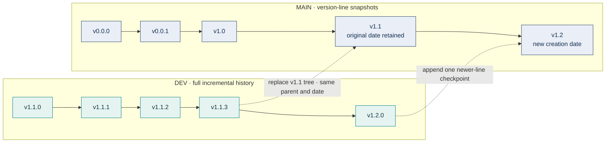
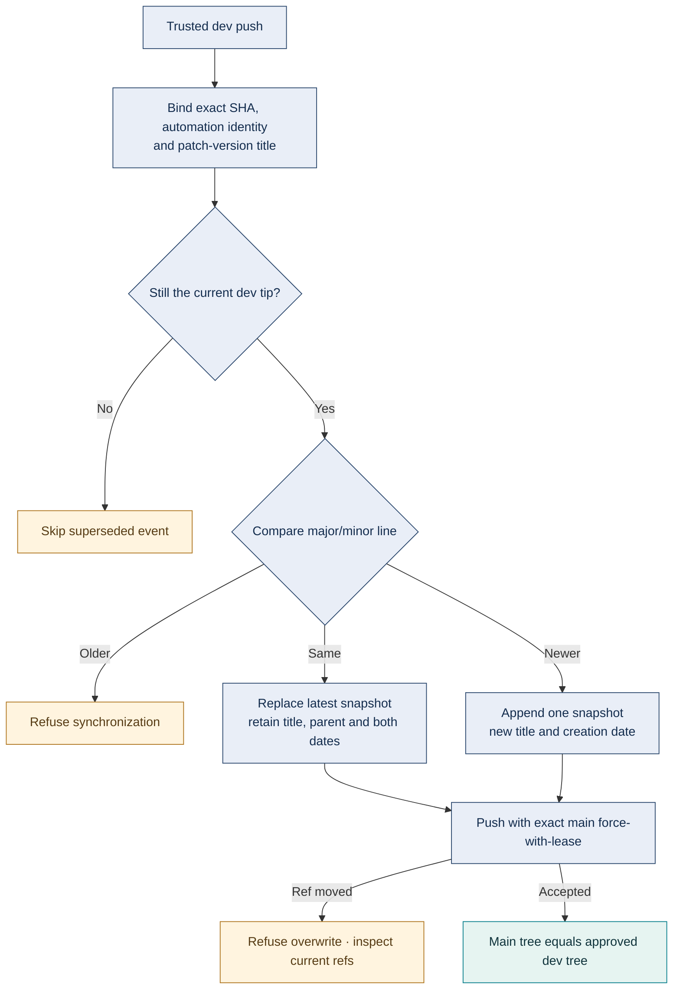

# Source history and version policy

**Audience:** contributors and release operators.  
**Authority:** this document defines repository history and publication policy.
**Automation:** [`automation:fabric-v1-sol-supervisor`](../../.github/workflows/automation-pr.yml).

## Two views of the same source

| View | Purpose | History | Version label | Date |
|---|---|---|---|---|
| `dev` | Detailed development and evidence lineage | Every incremental commit | `v1.1.3: description` | Actual development commit date |
| `main` | Concise version-line overview | One rolling snapshot per major/minor line | `v1.1` | First creation date of that line |
| Published tag | Immutable released source | Original exact commit | `v1.1.0` | Original release source date |
| Release assets | Installed distribution | Original hashes and acceptance record | Package version | Published record |

The initial `main` history is `v0.0.0` → `v0.0.1` → `v1.0` → `v1.1`.
The two historical bootstrap checkpoints are explicitly retained. The rolling
`v1.1` snapshot contains the development corrections through `v1.1.3`.

This diagram describes source synchronization, not Git ancestry between the two
branches. Their trees converge; the complete dev history is not merged into main.

## Automatic synchronization

Every trusted dev push triggers the named workflow. It operates on Git objects
in a bare repository; it does not execute or check out the development source.

For the same line, the workflow rewrites only the latest main checkpoint.
It preserves author and committer dates including their Git timezone offsets.
Its SHA changes when the source tree changes. An identical current tree is a
no-op. A queued older dev event cannot restore outdated source.

A newer line, such as dev `v1.2.0`, adds `main` checkpoint `v1.2`. A source from
an older line is refused. Every new commit uses author and committer
`automation:fabric-v1-sol-supervisor <automation@fabric.invalid>`.
Do not add human coauthors or `Co-authored-by` trailers. Development commit
titles begin with the current patch version; main titles contain only the
major/minor checkpoint label. Never fast-forward dev onto main or add ordinary
fix, documentation or merge commits to main.

The user has authorized rolling synchronization on every trusted dev push;
no per-push confirmation is required. Other public-history restructures require
explicit authorization, an exact remote backup first, and force-with-lease
against the expected old ref. Published tags and assets must never move to
match a rolling checkpoint.

## Review, recovery and releases

Review development changes and perform applicable requested verification before
publishing dev. This source-view synchronization does not itself qualify a model
route, candidate, installed package or release. Publishing a release still needs
its applicable acceptance, review and Sonar/security gates.

Routine synchronization does not open a PR for each development push. If a
main-targeting PR is explicitly requested, create it through automation using a
snapshot branch and a separate bot-backed publication procedure; the rolling
synchronization job does not create PRs. Never merge the dev lineage into main.
Attach any created PR to the originating Codex task.

After a missed synchronization, inspect the latest dev workflow and current refs.
Rerun that workflow only if its source SHA is still the current dev tip, or
publish the next reviewed increment. There is no manual branch-selecting trigger.
After a lease conflict, inspect the new main head before rerunning.
Never bypass the lease or force-push an assumed ref.

The one-time consolidation backup is
`backup/main-before-version-checkpoints-20261005`, at
`09a646522d3bfa0eb8cfbe545406971c695b7ffd`. Original development commits also remain
reachable on dev. Published `v1.0.0` and `v1.1.0` tags and assets are unchanged.
Historical reports describe their recorded SHA/date; use their original evidence,
not today's rolling main date, to interpret those results.
