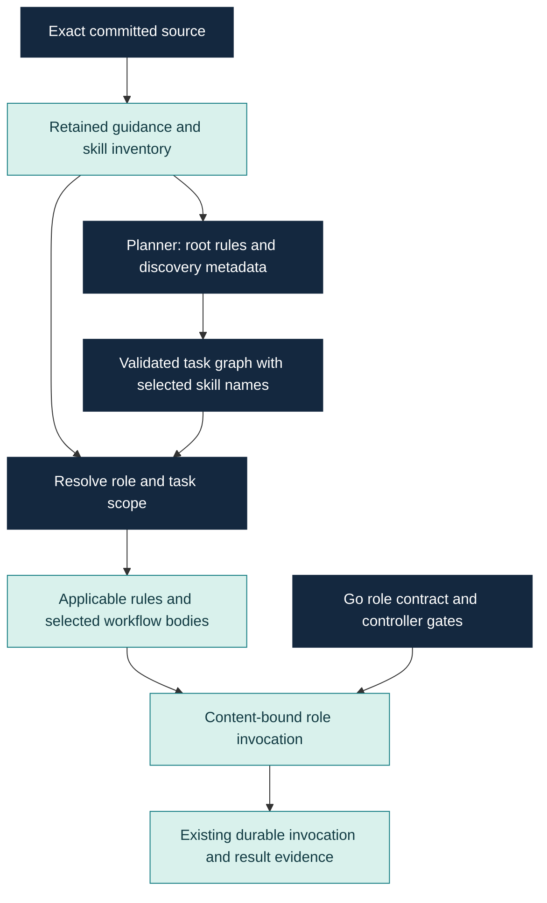

# Agent context: repository rules and reusable workflows

New `fabric run --autonomous` runs capture committed `AGENTS.md` files and
`.agents/skills/*/SKILL.md` files before run creation. This is enabled by
default; `--agent-context=false` retains the earlier context behavior for a
new run. Existing runs retain their original inputs and do not adopt new rules.
Only committed regular UTF-8 files are eligible. Dirty edits to instructions
are not loaded. Capture failures identify the affected file or bound before
any run or provider dispatch; correct the committed guidance or explicitly
disable this optional input when creating a new run.

## Four responsibilities

| Input | Responsibility |
| --- | --- |
| README | Human-facing product explanation and entry points |
| AGENTS.md | Repository map and applicable working rules |
| docs | Detailed knowledge, normative contracts and scoped evidence |
| SKILL.md | An advisory reusable workflow for a relevant task |

Go role contracts retain tool/write boundaries, identity checks and output
schemas. Repository guidance and skills cannot change verification gates,
repair budgets, retry authority or external-effect ownership.



## Scope and precedence

- Planner receives root guidance, before task ownership exists.
- Graph explorers receive root plus ancestors of their task scope paths.
- Writers and fixers receive root plus ancestors of their declared write paths.
- Reviewers receive root plus guidance for recorded changed paths and completed
  implementation ownership, conservatively retaining scope from earlier repairs.
- An ad-hoc explorer uses retained exploration path observations, when present.

Parent rules precede more specific rules. A root scope does not load every
nested file. An explicitly scoped subtree also includes its contained guidance;
sibling instructions apply only within their own directory. Guidance is frozen
at the original source commit; candidate edits
and later repository changes do not change a running invocation's instructions.
Agent configuration paths remain protected by existing write restrictions.

## Skill discovery and selection

Skills use [standard YAML frontmatter](https://agentskills.io/specification).
Fabric recognizes the optional string metadata `fabric.roles`:

```yaml
---
name: blast-radius
description: Trace consumers and regression impact of a proposed change.
metadata:
  fabric.roles: "planner,explorer,fixer,reviewer"
---
```

Omitting `fabric.roles` makes the workflow discoverable for all five model
roles. Empty, unknown or repeated roles are rejected. This is a discovery
filter, not a security permission or native-host tool grant.

The planner sees metadata with allowed roles across the catalog so it can
assign workflows to downstream tasks. Other roles see only their permitted
metadata. The planner can supply up to four unique `skills` names per task:

```json
{
  "id": "parser-fix",
  "kind": "implementation",
  "skills": ["tdd", "codebase-trace"]
}
```

This is an excerpt, not a complete task schema. Names must exist in the bound
catalog and be allowed for the executing role. Native verification does not
select skills. A fixer with no explicit selection loads `repair` if available;
a reviewer with no explicit selection loads `code-review` if available. Missing
defaults are optional. Explicit missing or disallowed selections are rejected.

Skill bodies are included only when selected. Scripts, assets and references
are not automatically loaded or executed; source tools retain their ordinary
committed-source contracts. This works through Fabric's role prompt builders
for configured runtimes; it is not a claim of native skill registration in
every provider or host.

## Identity, replay and bounds

The creation record retains source identity/commit and complete document bytes
with SHA-256 hashes. The bundle has a canonical content identity. Each role
prompt records the bundle identity, applicable documents, catalog metadata and
selected bodies. The existing invocation identity covers the entire prompt
and candidate/task input. No new recovery, settlement or replay controller is
introduced. Replay validates retained hashes/metadata and performs no live
instruction read. Started task revisions cannot alter selected skill names.

Bounds: 96 captured files, 32 skills, 16 KiB per file, 512 KiB retained content,
512 unique scope paths, 96 KiB serialized role selection, and the existing 256 KiB total invocation
limit. Required instructions are never silently truncated. These are explicit
input bounds, not measured token, memory or latency improvements.

Use `fabric run --autonomous --inspect-plan` to see whether committed agent
context is enabled without creating a run or calling a provider. The report
describes selected configuration; it does not establish capture or execution.
Inspect the creation and invocation records for the actual captured inputs.

Provider execution, selection quality and end-to-end benefits require their
own evidence. Earlier task cohorts do not qualify this new behavior.

The graph schema with bounded task skill names is shared by controller prompt
construction and Codex wire admission. The adapter accepts exactly the legacy
schema or this extension; arbitrary schema substitutions remain rejected.
The [initial parser canary](../evaluation/agent-context-parser-canary.md) exposed
the former mismatch at this boundary. Its original blocked run remains retained;
source regressions for the correction do not establish a live quality win.
