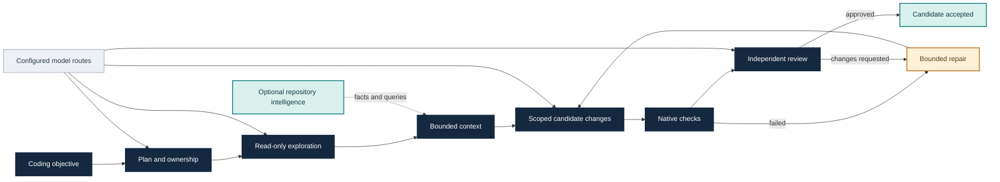

# Fabric capabilities

This guide describes development capabilities and links to evidence at its
recorded source scope. It is not an installed-release qualification. The
published v1.1.0 acceptance applies to Windows amd64; the broader v2.0.0 product goal
remains open. See the [source history policy](../contributing/source-history.md)
for the difference between incremental `dev` history, rolling `main` snapshots
and immutable release tags.

## The capability path

The capabilities below support this path. Optional intelligence and runtime
routes enrich configured steps; they do not replace candidate identity,
verification, review or effect checks.

Separately authorized local Muse route work passed one go-humanize task with
native verification, approved review and unchanged held-out acceptance, using a
custom development binary. See the [Muse guide](muse-go-route.md) and
[capability fallback guide](graceful-capabilities.md). Later optional-capability
source changes require their own verification; this single task does not change
the frozen evaluation scores below.

## Start a coding task

Use the [source-build happy path](autonomous-task.md) for the current checkout,
or the [installed Windows guide](../getting-started/installed-autonomous-task.md)
for the recorded release. Configure your authenticated model and the project's
required checks before `fabric run --autonomous`. Inspect the exact run with
`fabric inspect RUN`, `fabric usage RUN`, `fabric diff RUN` and
`fabric checkpoint RUN`. Results remain in an isolated workspace; integration
requires explicit operator action.

Optional RI/planner intelligence also needs the Rust `engorch-ri` executable
and its explicit SHA256 pin. From a source checkout, build it with
`cargo build --locked --release --bin engorch-ri` using the repository's Rust
toolchain; native Windows builds need the Visual Studio C++ toolchain. A Windows
bundle includes both executables. See the [packaging guide](release.md) and
[RI query examples](engineering-orientation.md) for paths and pinning.

## Implemented capabilities

Current development also provides [repair diagnosis](repair-diagnosis.md)
through `fabric diagnose RUN`: source-typed findings, conservative Go diagnostic
locations, stale-candidate labels and exact ready repair-task write scope.
`--anchor` validates bounded file preimages and explicitly relocates unique
previous code hints; verified owned findings can suggest a localized repair.
It is advisory inspection; automatic repair routing and live quality gains
remain unqualified.

New autonomous runs additionally use [source-bound agent context](agent-context.md):
scope-aware repository instructions and role/task-selected workflows from
`.agents/skills/`. This extension has separate verification scope and is not
qualified by the earlier eight-task ledger.

| Capability | What it provides | Usage and limits |
| --- | --- | --- |
| Autonomous engineering | Planning, exploration, dependency graph execution, writing, native verification, review and bounded repair | [Autonomous tasks](autonomous-task.md), [task graphs](graph-autonomous-task.md); default repair ceiling 2, configurable 0–8 before creating the run |
| Repository intelligence | Committed Go syntax facts, source/module/package identities, imports, unresolved calls, generator/test relations and immutable candidate overlays | [Go facts](go-file-facts.md); PARTIAL coverage, committed source rather than dirty worktree bytes |
| Engineering queries | Symbol/import/call/impact/module/topology/path queries, bounded objective ranking, SCIP references and explicit IMPLEMENTS paging | [Orientation and semantic queries](engineering-orientation.md), [CLI reference](../reference/cli.md); no inferred type/call/build completeness |
| Context compilation | Bounded role context, optional planner source/contract context and generator ownership evidence | [Planner contract](planner-contract.md), [planner measurements](../evaluation/planner-parse-cache.md); planner enrichment is opt-in |
| Parallel work | Bounded explorers, disjoint writer proposals, resource-vector admission and isolated initial writer worktrees with serial integration | [Isolated writers](isolated-writers.md), [task graphs](graph-autonomous-task.md); shared generators/hubs require ownership or dependencies, repeated isolated writer cohorts remain limited |
| Impact-aware review | Candidate-bound graph/context, bounded semantic groups and cross-cutting evidence for the reviewer | [Reviewer context](reviewer-impact-context.md); advisory context cannot replace an approved review or native checks |
| Deterministic reuse | Opt-in per-file parse facts, candidate-review facts and exact Go-format observations | [Parse-cache measurements](../evaluation/autonomous-parse-cache.md), [candidate facts](../evaluation/candidate-review-facts-cache.md), [format observations](deterministic-go-format-observation.md); bounded keys, corruption checks and eviction, final verification remains fresh |
| Model allocation | Explicit writer/reviewer/fixer routes, static escalation and optional empirical fixer calibration with conservative fallback | [Allocation](model-allocation.md), [routing](model-routing.md), [calibration](empirical-model-calibration.md); UNKNOWN or insufficient evidence retains the baseline |
| Usage accounting | Matched runtime observations for input, cached/uncached input, output and reasoning | [Codex observations](codex-native-usage-observations.md), [token accounting](provider-token-accounting.md); cached input is part of input, reasoning is part of output, missing price/call counts stay unknown |
| Durable continuation | Candidate-bound checkpoints, fresh-context rounds and run-scoped pause/resume/cancel requests | [Checkpoints](checkpoints.md), [fresh rounds](verified-fresh-rounds.md); pause requests do not themselves terminate admitted processes or settle uncertain effects |
| Native compaction | Explicit Codex runtime compaction threshold and observed lifecycle evidence | [Compaction](native-auto-compaction.md); Fabric does not make conversation summaries authoritative |
| Agent coordination | Repository-local task schedules, resource ceilings, bounded messages and queued explorer spawn/follow-up | [Schedules](task-schedules.md), [CLI reference](../reference/cli.md); queued admission does not prove completed recursive execution |
| Runtime integrations | Configured Codex, OpenCode and direct-provider routes; a source-local Codex skill | [Codex integration](../../integrations/codex/engorch/README.md), [OpenCode deadlines](opencode-deadlines.md); runtime/provider/host qualification is specific to the recorded route |
| Packaging | Windows release bundles, integrity verification, installation and version-specific upgrades | [Release guide](release.md); unsigned artifacts and a successful build do not establish release acceptance, Linux remains unqualified |

## Verified outcomes and remaining work

- A separately frozen v1.0.25 Sol High evaluation passed **7/8** unchanged
  coding tasks: **fixed-six 6/6** plus generated numeric ownership. Each PASS
  has native verification, candidate-bound approved review and held-out
  acceptance. Godotenv exhausted its two repairs and remains BLOCKED.
- All eight tasks have 33 matched usage observations: 9,885,990 input
  (8,561,152 cached; 1,324,838 uncached), 101,281 output, including 27,989
  reasoning. Physical provider calls, price and exact durable READY transition
  timestamps remain unknown.
- A bounded Humanize topology comparison passed with two isolated writers;
  its serial arm blocked. Different plans/outcomes preclude causal speed or
  token-saving claims.
- Cache timings are mixed: warm corpus collection improved in one retained
  sample, while warm contract admission was slower. A later full-batch
  optimization had no useful measured latency gain and was discarded.
- Calibration retained its baseline; an unseen Wordwrap task passed with
  conservative fallback. No adaptive routing gain or default promotion is
  qualified.
- Two accepted coding rounds demonstrated fresh-context continuation, six
  second-round native compaction events, and pause/resume without another
  model invocation. Mixed versions and a shared parent runtime state home
  limit this qualification.
- Two v1.0.27 Windows packages were byte-identical and passed offline smoke
  checks. They are packaging evidence, not a new installed-task release gate.

The separate [eight-task closure ledger](../evaluation/v112-eight-task-closure.md)
records accepted evidence for eight task identities: the original frozen
cohort is 7/8, and a fresh authorized `logr` successor supplies the eighth
identity. That coverage used source `8c5a750` and the same task pin; it is not a
single unchanged 8/8 cohort or a full reevaluation of current v1.1.3 source.

The [product ledger](../roadmap/v2-product-plan.md) records exact identities,
qualification and the paused development checkpoint. Complete-cohort
acceptance, remaining efficiency evidence, final review and release gates
keep **v2.0.0 OPEN**. Donor research and synthetic experiments are described in
[research provenance](../research/oss-mechanisms.md); they do not establish
Fabric performance or justify speculative JEV, sandbox, memory or graph-store
features.
